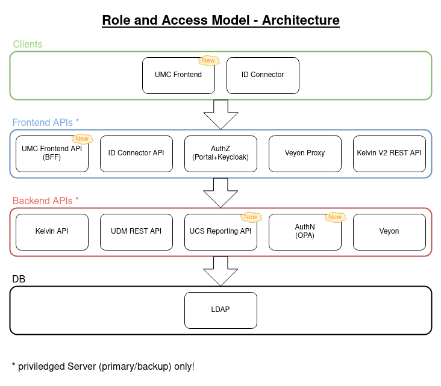
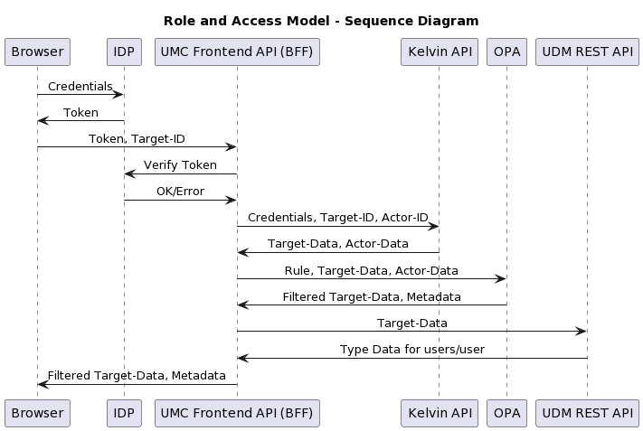

# New UI architecture for UCS(@school) frontend modules

---

- status: accepted
- deciders: Ingo, Marie
- consulted: UCS@school team

---

## Context and Problem Statement

We want to get rid of the UMC modules architecture, which uses a deprecated JavaScript framework version, a proprietary network protocol, is stateful and does not scale to high concurrent user counts.
In its current version it also makes a lot of work to improve accessibility aspects.

The new frontend architecture should follow modern principals that are known to most frontend developers.

## Decision Drivers

- Accessibility requirements.
- High scalability requirements.
- Make recruitment and integration of new frontend developers easier, as they will be presented with a modern, non-proprietary architecture.
- Improve development speed and reusability through separation of frontend and backend development.

## Considered Options

- Change Python backend: Keep the old UMC architecture, and just call REST APIs from the Python backend.
- Call REST APIs from UMC frontend: Keep the old UMC fronend, reduce the Python backend and call REST APIs directly from JavaScript.
- Complete rewrite: Complete rewrite of the frontend using a new JS framework and calling REST APIs directly from JS.

## Decision Outcome

Chosen option: "Complete rewrite", because
it is the only solution that will attract new developers and scales.

### Positive Consequences

- Improved UI development speed.
- Reduced memory footprint (no Python backend process per session).
- REST backends are easy to benchmark.
- Easier recruitment.

### Negative Consequences

- Current UI developers have to learn new framework.
- Existing UI modules cannot be reused.
- Lots of details (like deployment, l18n etc) have to be clarified and stabilized, which are already known for the old system.
- Because of the unknowns, there are higher risks for the first implementations.

## Validation

- Retro regarding development process (separation of UI and BFF).
- Benchmark concurrent users.
- Validate accessibility features.
- Feedback of HR to changed recruitment requirements.

## More Information

Diagrams:

 *Components and layers of RAM Architecture*

 *Sequence diagram of an example page access*

Links to related decisions and resources:

- [ADR 0002 js-framework](0002-js-framework.md)
- [ADR 0003 rest-service-dedicated-to-ui](0003-rest-service-dedicated-to-ui.md)
