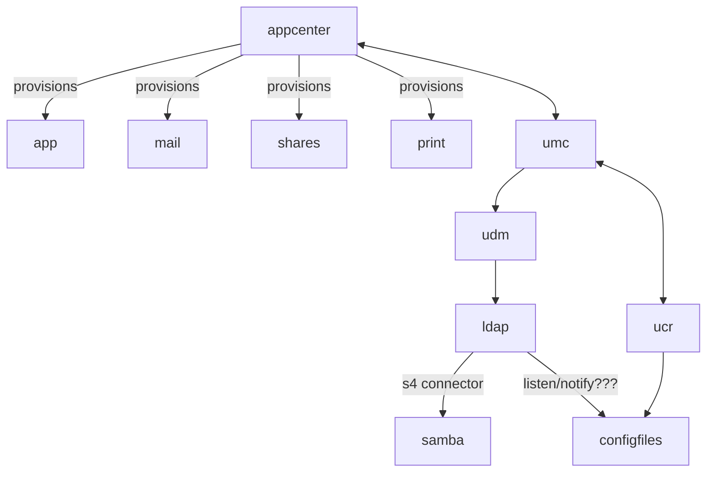
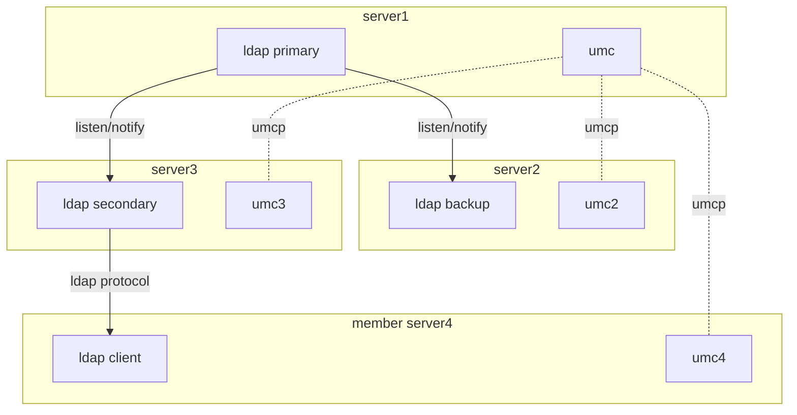
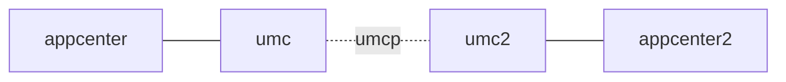

Down the dev rabbit hole
========================

Overview
--------

UCS is a linux system/distro which is targeted at organizations to provide:

- Identity- and infrastructure management
- Providing or integration within a domain
- Mechanisms to run virtual machines
- Running ready provided apps
- Services for printing, file sharing, mail

UCS is installed on all the participating machines.

See: [ucs] (german)

### Single machine

Within such a machine you will find many components:

- **appcenter**: allows the provisioning of apps and services
- **app**, **shares**, **print**, **mail**: examples for apps and services
- **umc**: the univention management center, the central management component
- **ucr**: key/value store for variables; used in scripts and for generating **configfiles** for
  apps and services. See: [ucr]
- **udm**: is a wrapper around the **ldap**, to add ucs specific logic around the 'pure' ldap
  objects. Among other handles CRUD of dependent objects. Objects within ldap have *attributes*,
  objects from udm have *properties*. See: [udm]
- **samba**: provides active directory services and other sharing services (print, shares). Is 
  synced
  with the ldap using a connector, e.g. s4 connector in this case.

### Multi machine setup

Multiple machines can be setup in different roles within a (ucs) domain.

There is one, and only one machine in the role of the domain controller **primary***. This server
contains the **ldap primary**, the only place where data is written into the ldap. This primary
also contains ssl and other security relevant data. See: [ldap], [domain]

The **ldap backup*** mirrors everything the primary contains, but only as a read-only backup. This
backup can be upgraded into a primary server in case of failure of the real primary.

An **ldap secondary*** contains a subset of the primary data (even though the subset could be all
the primary contains). This is also read-only, and can not be upgraded to a primary. Use case is
e.g. a smaller organizational unit that doesn't need to know "everything", and for horizontal
scaling.

A **member** server doesn't have its own copy of the ldap data, but accesses the data from other
servers, e.g. a secondary.  (??? how does it get its data?)

All synchronization between ldap servers is done using a **listen/notify** mechanism. This mechanism
allows hooks to be called on actions, allowing e.g. for syncing servers, writing configfiles etc.
See: [listener]

Other communication then ldap syncing between machines is done using the umc protocol **umcp**. This
protocol allows sending of data as well as calling commands.

??? Are there other ways?

If the main appcenter needs to install applications on the other machines in the domain, it uses umc
to speak to other machines, which in turn communicate with their respective appcenters

Dev Setup
---------
tbd

Code Locations
--------------
tbd

Call flows
----------
tbd

[listener]: https://docs.software-univention.de/handbuch-4.4.html#introduction:Listener_Notifier-Replikation

[ucs]: https://docs.software-univention.de/handbuch-4.4.html#introduction:Was_ist_Univention_Corporate_Server

[ldap]: https://docs.software-univention.de/handbuch-4.4.html#domain-ldap:Einfuehrung

[domain]: https://docs.software-univention.de/handbuch-4.4.html#introduction:Domaenenkonzept

[join]: https://docs.software-univention.de/handbuch-4.4.html#domain-ldap:joinscripts

[schema]: https://docs.software-univention.de/handbuch-4.4.html#domain:ldap:extensions

[ucr]: https://docs.software-univention.de/developer-reference-4.4.html#chap:ucr

[udm]: https://docs.software-univention.de/developer-reference-4.4.html#chap:udm

