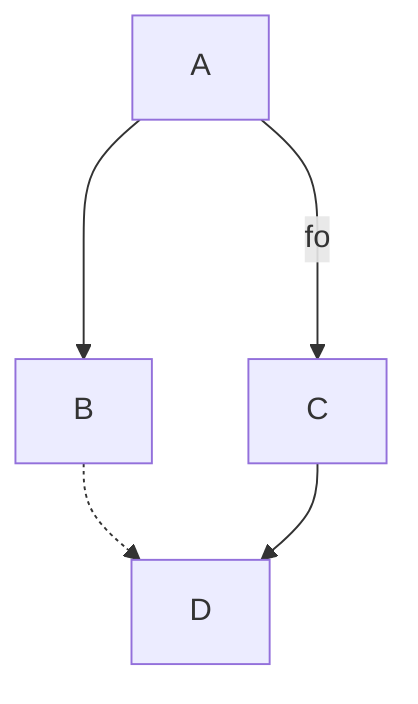
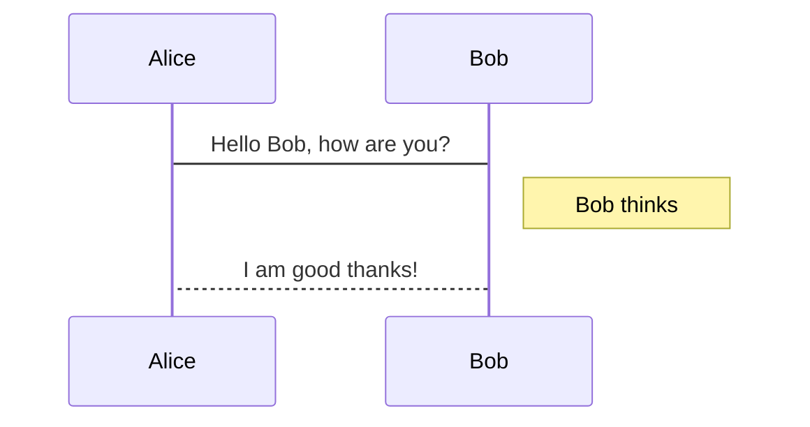

Plantuml
========

```plantuml
Bob -> Alice : hello
Alice -> Bob : hi
```

Mermaid
=======

```mermaid
graph TD;
  A-->B;
  A--foo-->C;
  B-.->D;
  C-->D;
```

Some text in between

```mermaid
sequenceDiagram
    Alice->Bob: Hello Bob, how are you?
    Note right of Bob: Bob thinks
    Bob-->Alice: I am good thanks!
```
