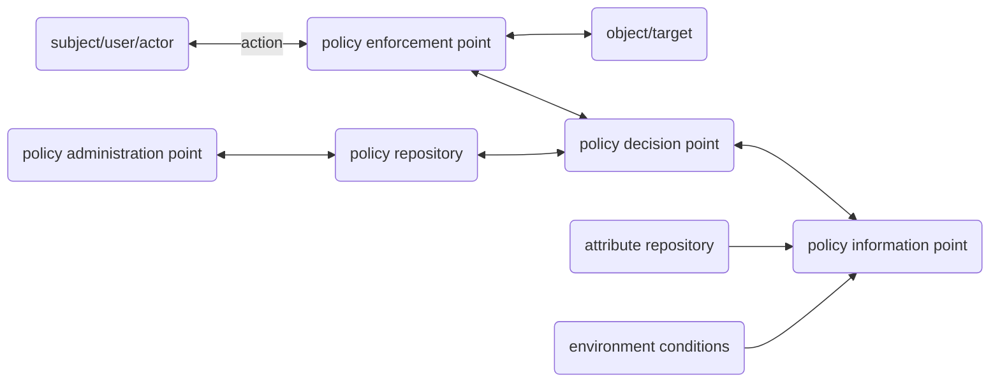
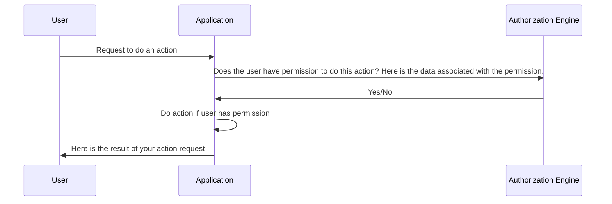
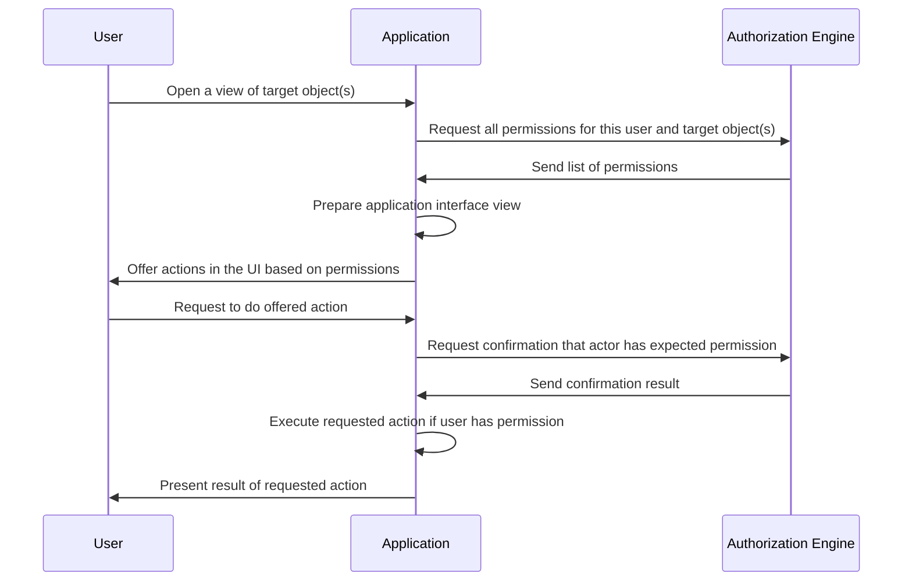
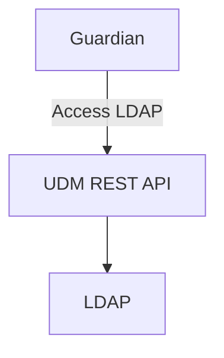
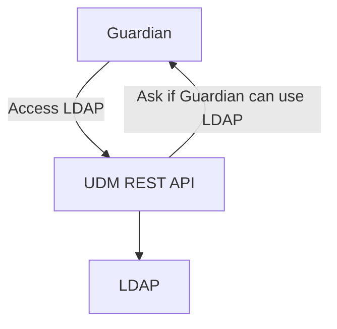

# Requirements and concept for the UCS authorization engine

[[_TOC_]]

## Introduction

This document gathers user stories and requirements for the UCS authorization engine and introduces definitions.
Implementation details, API specifications, and architectural recommendations will be part of a separate document.
"UCS Authorization Engine" is the working title of this software component and subject to change; it is called the **Guardian** in this document.

Access management in UCS is currently done with LDAP Access Control Lists (ACLs).
Managing LDAP ACLs for a set of permission requirements is increasingly inefficient when the set of permissions increases.
Additionally, more complex permission policies require more powerful way to create and manage permissions in UCS.
Those policies may depend on the attributes of the involved objects.
With the Guardian, attribute based access control (ABAC) will be introduced, which subsumes other access control models like role based access control (RBAC) and discretionary access control (DAC).
With ABAC, policies with these requirements can be implemented.
Note that the Guardian will not be able to completely replace ACL usage in UCS, but it strives to be the replacement for most use-cases.

## TL;DR

This document covers the requirements and higher-level design decisions that we want to consider in the first release of the UCS authorization engine ("Guardian").

Guardian is a service that will handle authorization (but not authentication) for services in the UCS and SWP ecosystem.
It will use [OPA](https://www.openpolicyagent.org/) as a policy backend, and code for the policy backend is written in Rego.
Guardian should also be configurable via adapters to connect to a storage backend (e.g., LDAP, postgres) and an authentication backend (e.g., Keycloak).

*NOTE:* Guardian is only a policy decision point; it cannot enforce policies or carry out policy decisions on behalf of an application.
The policy enforcement point remains within applications that use the Guardian.

All elements needed for policies (roles, permissions, contexts, role-capability-mappings) are assigned to a namespace, in order to prevent unintentional collisions between different applications.
The namespace consists of an app name (e.g., app ID in Univention App Center) and a namespace name, so applications can register multiple namespaces for the purpose of managing/creating policies.
Applications are allowed to use elements from other namespaces when managing/creating policies.

Guardian will run as an HTTP service with the following endpoints:

* Authz
  * "Given a desired permission, does the actor have it for specified targets?"
  * "Given specified targets, what are all the permissions of an actor?"
  * Custom authz endpoints
* Management
  * Register an app and create an app-admin role
  * CRUD
    * CRU for namespaces
    * CRU permissions
    * CRU for roles
    * CRU for contexts
    * CRUD for role-capability-mappings
  * Custom code
    * CU custom code for conditions
    * CU custom endpoint in the Guardian API to run arbitrary code
  * UI support -- retrieve read-only all:
    * namespaces
    * roles
    * contexts
    * permissions
    * conditions

For most Guardian elements (namespaces, roles, etc.), delete endpoints as part of CRUD will be out of scope for the first release, because it complicates data management in LDAP and the role-capability-mapping.

Guardian should also provide a CLI and python3 library to work with these endpoints.

We will need some updates to UDM to support returning roles information on actor/targets for use in the Authz endpoints.

## Traditional Model and the Guardian

In common ABAC architectures (see e.g. [NIST SP 800-162](https://csrc.nist.gov/publications/detail/sp/800-162/final)) there is the notion of multiple functional points.



Here, in this diagram, subject, user and actor are used interchangeably.

* The application with which the actor is interfacing contains the policy enforcement point (PEP), and the application requests decisions from the Guardian.
* The Guardian contains the policy decision point (PDP), where the decision is made if an actor is authorized to do some action.
* The Guardian works with policies from a policy repository, which is managed by a policy administration point (PAP).
* The policy information point (PIP) is stored in UDM, but for some requests (see **SWP1**) the Guardian can retrieve roles and contexts on behalf of an app.

Note that the results of requests to the Guardian will not only be of boolean type. A complex example is the request for all capabilities an actor has with respect to a target.
The Guardian will then evaluate and decide which permissions the actor has in that context (e.g., `school1`) and returns those to the application.

For a very simple case, the sequence diagram of events will look like this:



In an actual interaction between application and authorization engine, this can look very differently:



Here, the user opens a view of one or more target objects.
An example view is a table of object attributes for a number of objects.
Depending on what permissions have been returned by the authorization engine, the interface will be adjusted.
See the user stories for other interactions between an application and the authorization engine.

## Definitions

### Actor

An actor is any entity that is authenticated with the application, which can do actions within an application.

Actors can receive **Roles** that define their **Capabilities** within a given **Namespace** for an **Application**.
For example, a user may receive the role `teacher` that gives them the capability to `resetPassword` if the **Target** is a `student` in UCS@school.
In most cases, an actor will be a user, but it can be other LDAP objects (e.g., a server).

Groups can also receive roles which apply to the members of the group (e.g., via a `member_roles` field).
When asking what roles a user has, the roles on a user's groups should also be taken into account.

*Note:* Changes to which actors belong to a group, are not handled by the Guardian.

### Permission

A permission is a string that represents an operation that an **Application** wants to take, on behalf of an **Actor** operating on some **Target**.

Guardian does not perform any actions on behalf of an application, and is completely ignorant of what any given permission string means.
It is up to each application to manage the meaning of their permissions within their own app, and to have the ability to execute operations related to those permissions (e.g., write to LDAP, connect to UDM, etc.).

Some examples of permissions:

* `read-first-name`
* `export`
* `can_view`

Permissions are expected to be alphanumeric ASCII (lower-case), with underscores or hyphens (no spaces).

An **Application** might request some permissions for an authenticated user from the Guardian to adjust the interface for a better user experience.
For example, the application may mark buttons as unavailable or hide them if the user cannot do the underlying action, such as writing a field of an object, or creating new objects.

### Target

A target is the object that a **Permission** applies to.
For example, an **Actor** might have the permission to `read_email` of a target user.
A **Permission** can apply to multiple targets.

In most cases a target will come from an LDAP object, but it could be any object from any data source that can be translated into JSON.
Targets are optional parameters for requests when doing **Capability** checks.

Example targets:

* A student object from LDAP
* An API endpoint
* A JSON object taken from an external service provider

### Application

An application (or app) refers to any component that wants to create and manage a **Namespace** and related **Policies** maintained by Guardian.
Most of the time this will be an app from the Univention App Center, but this does not exclude other software components in any way.

Throughout the document, there will be references to the "app name".
For UCS apps, this should refer to the app ID used in the Univention App Center; however SWP apps may have their own naming convention outside the App Center.

App names should be alphanumeric ASCII (lower-case) with hyphens or underscores (no spaces).

### Policy

A policy is a set of rules in OPA, which are modeled as functions in Rego code. (Please read more about OPA [here](https://www.openpolicyagent.org/docs/v0.12.2/how-does-opa-work/)).
Whenever we refer to a policy, we are referring to relevant compiled rules in OPA.

Policies are built through a collection of Rego code (maintained by Guardian), combined with **Role-Capability-Mapping** JSON that maps a **Role** to the **Capabilities** it is allowed to have.

### Capability

A capability is the combination of a **Permission** with possible **Conditions** that limit what a given **Role** is allowed to do.
The conditions within a capability are linked by either by an AND or OR relation.

A capability might apply to a **Target**, or it might apply only to a given **Context**.

* *Target Example:* a teacher can only edit another target user, if the user is a student.
* *Context Example:* an administrator in School1 can only create students for the `school1` context.

### Role

A role is a string that allows us to match **Actors**, or LDAP groups containing actors, with a set of capabilities in a **Role-Capability-Mapping**.
For example, an authenticated user might be granted the role of `email-admin` in OX.

Roles may also be placed on **Targets** to determine whether an actor is allowed to manage the target.
We plan to store roles on all objects (actor or target) in a `roles` field in LDAP.

A group can receive two types of roles:

1. A `member_roles` field: these roles apply to any members of the group.
2. The `roles` field: these are standard object roles, that determine who is allowed to manage the group.

A role is associated with a **Namespace** and an **App** name, for example the role `teacher` could be in the namespace `ucsschool-users` from the `ucsschool` app.
A role is optionally associated with a **Context**, the role `teacher` for a particular user might be only applicable in `gymnasium1`.

Roles are alphanumeric ASCII strings (lower-case) with hyphens or underscores, no spaces, with the parts of the role separated by colons:

* Rolestring format without context: `app-name:namespace:role-name`.
* Rolestring format with context: `app-name:namespace:role-name&app-name:namespace:context`.

### Context

A context is a string tag that restricts a **Role** to target objects sharing the same tag.
A user might have `role-A` in context `schoolX` but `role-B` in context `schoolY`.
This is especially important in UCS@school, where users may only be allowed to manage other users within their own school context.

Contexts are namespaced, in the same way roles are namespaced -- i.e. `app-name:namespace:context`.
When combining a role+context, the string would look something like `app-name:namespace:role&app-name:namespace-context`.

Roles have the following behaviors, when checking whether an actor and target are in the same context:

* No context on actor and no context on target: same context
* Context on one (actor or target) but no context the other: different context
* Asterisk ("\*") context on actor or target, regardless of context/no-context on the other: same context

*NOTE:* Contexts are primarily a use case for UCS@school, and we don't expect many other apps to use contexts.
For this reason, contexts are optional in all places where roles are used.

Contexts are alphanumeric ASCII strings (lower-case) with hyphens or underscores, no spaces.

### Condition

When defining a **Capability**, conditions are boolean functions that can be used to further restrict which **Permissions** are available to **Role**.

Example: An actor with the role `student` has the permission to `change_target_password`, provided the condition `target_is_self` -- i.e., the `uid` attribute of the actor is checked for equality with the `uid` of the target.

Conditions are written in Rego and stored in the Guardian.
Names of conditions are alphanumeric ASCII (lower-case) with underscores.
Custom conditions for **Apps** should be prefixed with the app name and namespace -- e.g., `my_app_my_namespace_my_condition`.

### Role-Capability-Mapping

This is a mapping from the **Role** to **Capabilities**.
This is what we use to generate **Policies** in OPA.

A mapping with a single role might look like this:

```json
{
  "roleCapabilityMapping": {
    "ucsschool:users:teacher": [
      {
        "appName": "ucsschool",
        "namespace": "users",
        "capabilities": [
          {
            "conditions": [],
            "relation": "AND",
            "permissions": [
              "read_first_name",
              "read_last_name"
            ]
          },
          {
            "conditions": [
              {
                "name": "ucsschool_users_target_has_same_school",
                "parameters": {},
              },
              {
                "name": "target_has_role",
                "parameters": {
                  "role": "ucsschool:users:student"
                },
              }
            ],
            "relation": "AND",
            "permissions": [
              "read_first_name",
              "write_password",
              "export"
            ]
          }
        ]
      },
      {
        "namespace": "mail",
        "appName": "OX",
        "capabilities": [
          {
            "conditions": [],
            "relation": "AND",
            "permissions": [
              "edit-spam-filter",
              "export"
            ]
          }
        ]
      }
    ]
  }
}
```

The first key is an actor's role, which is mapped to **Capabilities** associated with a **Namespace**.
Each capability is made up of a set of **Permissions**, which have 0 or more **Conditions**.

## Design Considerations

The existing code that the UCS@school team has already implemented uses [OPA](https://www.openpolicyagent.org/), with the [Rego policy language](https://www.openpolicyagent.org/docs/latest/policy-language/).
Unless there is a technical reason to not use OPA/Rego, we suggest that the Guardian should make use of it as a policy backend, as it makes it easier to translate existing UCS@school implementations to the new authorization engine.

However, we want to make it clear that when designing an API for the Guardian, all UCS and SWP apps should be capable of interacting with the Guardian without knowing the policy backend.
This means that apps don't need to write Rego code to handle the most common use cases, unless they have a special use case and want to register custom code.

What we expect from services using the Guardian:

* They have the ability to connect to Guardian via HTTPS.
* They can do one of the following:
  * They have the ability to authorize with our identity provider, if they need us to perform LDAP (or other data store) lookups for actor/targets on their behalf, OR
  * They have access to UDM (or alternate data store) to provide the actor/targets they want to authorize.
* They can perform whatever operations on behalf of the actor that they want to authorize (i.e., Guardian cannot perform these operations for the service).

## Expected Users of the Guardian

We expect to have two types of users for the Guardian, apps and administrators.
This section discusses more about how each of these users is intended to use the Guardian.

### Apps

See the definition of **Application** above.

Apps with authenticated users, is the primary use case for the Guardian.
An app has users that want to perform some operation in the app (viewing an API endpoint, editing a field on an object), so the app asks the Guardian either for a list of what the user is allowed to do, or for a yes/no answer to whether the user is allowed to perform a specific action.
Based on the response from Guardian, the app can then decide whether to perform the operation on behalf of the user.

In addition to doing authorization checks, we expect apps will normally want to:

* Create namespaces to store elements of the Guardian that it uses.
* Create default/suggested roles to be used by **Administrators**.
* Create permissions that define what a user is allowed to do in the app.
* Create contexts, if the app uses them.

Less frequently, an app may also want to:

* Provide a default role-capability-mapping for the app namespace as an example of how to use the roles, that **Administrators** can modify later.
* Create a custom condition to be used in its default role-capability-mapping.
* Register a custom authorization endpoint, if it can't get its authorization needs met through the standard endpoints.

When an app is first installed and wants to make use of the Guardian, it needs to (at a minimum) register a namespace with the Guardian as part of its join script.
It then gets an administrative role that it can assign to machine accounts to help manage the namespace, or that role can be given to humans (see **Administrators** below) for additional custom configuration.

Apps should register all permissions that they check for in the code, for a given namespace.
For example, UCS@School needs to allow some users to `export_csv`, so it will register this string with the Guardian as a permission.
This permission can then be used in role-capability-mappings, either provided as a default from the application, or later changed by **Administrators**.

Apps will probably also want to register some default roles that should be used with the namespace.
For example, in UCS@school, we have `student`, `teacher`, `staff`, and `admin` roles that we want to provide by default, although **Administrators** can create custom roles that they use instead.

Depending on the application, the app may also register contexts, either as part of a join script or done via notifier.
For example, in UCS@School this will be done through notifier, to create a new school context whenever a new OU is added.

The app may also have custom conditions or custom Rego endpoints that it needs in order to perform authorization requests.
This will most likely be created during a join script.

### Administrators

The primary administrator of the Guardian is likely a Domain Admin, but the Guardian also provides roles that can be given to other users either to manage all namespaces within Guardian, or manage individual namespaces within Guardian (e.g., to allow one person to manage OX email permissions).

Generally, we see the following use cases for an administrator:

* Create custom roles, if an app's default roles don't provide what the administrator needs.
* Update the role-capability-mapping, to match the roles and restrictions the administrator wants to have.

Less frequently, an administrator may want to:

* Create custom contexts, if an app doesn't create what they need.
* Create a custom condition to be used in a role-capability-mapping.

*NOTE:* We don't expect administrators to use the custom Rego endpoint creation, because that would require apps to know what endpoints were created in order to know where to authorize.
Apps may choose to support changing the authorization endpoint as a configuration option, but that is not explicitly handled by the Guardian, and is not the expected use case for the first release.

### Example process when installing a new app

1. A domain administrator installs the app `ExampleApp` with the App Center.
2. In the joinscript `ExampleApp` registers a new app with the Guardian Management API and attaches the app admin role
   to the apps machine account.
3. In the joinscript `ExampleApp` also registers namespaces, contexts and permissions with the Guardian Management API.
4. In the joinscript `ExampleApp` creates the `exampleApp:default:user` role with the Guardian, including a mapping giving
   the role all required permissions for normal usage.
5. The domain administrator attaches the role `exampleApp:default:user` to a group of their users in the UMC.
6. A user of this group logs in and opens `ExampleApp`.
7. `ExampleApp` contacts the Guardian Authz API and requests a list of all permissions the user has.
8. `ExampleApp` processes the retrieved set of permissions and enforces them according to the apps programmed logic.

## Requirements

Requirements have an identifier prefixed which is unique within this document.

### Requirements from UCS@school

These requirements stem from the point of view of an application developer and are partially replicated/derived from an implementation for the BSB Hamburg RAM project, see [source code](https://git.knut.univention.de/univention/ucsschool-components/ui-common/-/blob/main/rankine/opa/BFFBundle/ucsschool/bff.rego) in the [ui-common](https://git.knut.univention.de/univention/ucsschool-components/ui-common) repository.

#### Data structure requirements

Roles, contexts, permissions, and namespaces can be preconfigured in the Guardian using the API, however registration of these elements is required primarily for UI purposes.
In principle, we will not actively block use of unregistered elements in role-capability-mappings; validation of unregistered elements will not be in scope for the first release.
If we find after the first release of the Guardian that we have a substantial use case to validate/block unregistered elements, we can revisit this decision in a future release.

##### A1: Actors need to be associated with 1 or more roles, for at least one namespace, with optional associated contexts

In order for actors to receive an "allowed/true" authz response from the Guardian, they should have at least one role in a namespace where a role-capability-mapping is defined.
Actors without any roles will always return "not allowed/false" for any authz request.

Example: A user can be both a `password-admin` and an `email-admin` for the `ucs` namespace.
A user can be a `teacher` in the context `School1`, and a `student` in the context of `school2` for the `ucsschool` namespace.

Implementation example: In LDAP we might have a `roles` field on a user object, that stores the rolestrings `ucsschool:users:student&ucsschool:default:school_schule1` and `ucsschool:users:teacher&ucsschool:default:school_schule2`.

##### A2: Roles and contexts of an actor are modifiable

Example: A user can switch from `student` to `teacher` role.
A `student` in context `School1` can switch to context `School2` while remaining a `student`.

##### A3: Usernames can change. And when this happens, their old roles should be preserved

Example: User `student1`, with role student in `school1`, changes name to `student01` and is still a student in `school1`.

##### A4: Suggestion: store role+context as a role string on actors

When an actor is given a role and context, consider storing the two as a concatenated string with a designated separator -- e.g., `teacher` in `school1` becomes `teacher&school1`.
Roles should be fully namespaced, so a full namespaced example would be `ucsschool:users:teacher&ucsschool:default:school1`.

*NOTE:* If you go this route, be sure to document the separator character in public documentation, to let apps/users know they should not use the separator in roles, contexts, actions, etc.
When setting roles and contexts from the API, don't forget to strip out the separator character from any API input.

##### A5: Strings need to be lower-case

We don't know the data storage backend that we will use for storing Guardian-related data, but for UCS@school this will most likely be LDAP.
This means that strings need to be case-insensitive when doing lookups/comparisons:

1. Namespaces
2. Roles
3. Contexts
4. Permissions
5. Condition names

Even with a case-sensitive data store (e.g., Postgres), it could create unintentional confusion when troubleshooting, if it's possible to have the same element with two different cases (e.g., the role "teacher" and "Teacher").

For this reason, the backend should lowercase anything before storing or running searches/comparisons.

##### A6: Handle multiple versions of UDM/Guardian in the same environment

Administrators may not be able to upgrade all instances of UDM/Guardian at the same time, and it may take some time to migrate LDAP objects.
This means that if we change the format of objects between versions of the Guardian, we could have older versions of UDM trying to return newer versions of Guardian objects, and newer versions of Guardian trying to work with older versions of objects from UDM.

We need to think about an upgrade path for this.
One possible solution would be to always store Guardian objects (and possibly rolestrings) with version numbers.
Newer versions of Guardian/UDM could upgrade older objects when they encounter them, simply by checking the version number.
We could even have a period of crossover (e.g., via a UCR or DCD variable) where the newer code continues to read and write older versions of the objects until all Guardian/UDM instances have been upgraded, in order to support both old and new Guardian/UDM instances in the same system.
Once the UCR/DCD variable is removed, it would start writing the newer object format and converting old objects.

One other option, if we don't wish to decide right now about versioning objects, is that we could add versioning later and treat unversioned objects as "version 0".

#### Rego requirements

##### B1: In Rego, define a canonical set of conditions under which capabilities apply to a role

Conditions are functions which take a `condition_data` object as an argument, and return a boolean indicating whether the condition passed.
If evaluating anything in the function returns undefined, the function should return false.
The `condition_data` object can be expected to always have a minimum set of arguments that are available to the function:

* `actor`
* `role`: role of the actor for which the condition is being evaluated, from the role-capability-mapping.
* `target_old`: target before modification (the value may be null, if not supplied by the request)
* `target_new`: target after modification (the value may be null, if not supplied by the request)
* `parameters`: additional data passed in from the role-capability-mapping (see **Role-Capability-Mapping** definition for an example)
* `extra_request_data`: additional data passed in from the request

Example 1: A condition `target_is_self` that is true if the uid of the actor matches the uid of the target.
Only under that condition, the actor can change the birthday field.
This condition would make use of the `actor` and `target_old` keys.

Example 2: A condition `target_has_role` might expect the "role" key in `parameters` specifying what role to look for on the `target`.

Example 3: A condition `between_start_and_end_time` might restrict use of a computer to be between a specified start and end time.
This rule would make use of:

* parameters.startTime (from role-capability-mapping)
* parameters.endTime (from role-capability-mapping)
* extra_request_data.currentTime (from request data sent to the Guardian)

*NOTE:* Parameters and request data might be camelCased, unlike condition names, because they come from JSON.

These conditions will be made available to the API (see **D7**).
Guardian should store the following relevant information for each condition, to return as part of the API:

* Function name.
* Display name of the condition.
* Docstring for the condition.
* Parameter names (e.g., "role").
* Additional request data keys it expects (e.g., "contexts").

Here is a list of some conditions that we want defined in the Guardian (list may be expanded later):

* `target_is_self`
  * Returns true if specified fields (e.g. `uid`) of the actor match those of the target.
  * Takes 1 argument from `parameters`, "fields", which is a list of fields to compare between actor and target.
* `target_has_role`
  * Returns true if target has the specified role, regardless of context.
  * Takes 1 argument from `parameters`, "role" (role includes app name and namespace).
* `target_has_context`
  * Returns true if target has any of the specified contexts appended to any of its roles (see **Context** for definition of a match).
  * Takes 1 argument from `extra_request_data` in the request, "contexts".
* `actor_has_context`
  * Returns true if the actor has any of the specified contexts appended to its role.
  * Takes 1 argument from `extra_request_data` in the request, "contexts".
  * Takes "role" from the `condition_data` object.
* `target_field_equals_value`
  * Returns true if the value of the target's specified field matches the specified value.
  * Takes 2 arguments from `parameters`, "field" and "value".
* `target_field_not_equals_value`
  * Returns true if the value of the target's specified field does not match the specified value.
  * Takes 2 arguments from `parameters`, the "field" and "value".
* `target_has_same_context`
  * Returns true if one of the role contexts for the actor matches one of the role contexts of the target (see **Context** for definition of a match).
  * No context on the actor or target always returns True.
* `target_field_equals_actor_field`
  * Returns true if the specified field on the target matches the value of the specified field on the actor.
  * Takes 2 arguments from `parameters`, "target_field" and "actor_field".
* `target_has_role_in_same_context`
  * Returns true if the target has the role specified by the `parameters` in the same context that the actor has the role specified by the role-capability-mapping (see **Context** for definition of a match).
  * Takes 1 argument from `parameters`, "role" (role includes app name and namespace).

  Example pseudocode:

  ```text
  condition(actor, target, originating_role, context_params):
      for context in set(contexts_of(actor)).union(contexts_of(target)):
          if object_has_role(actor, originating_role,  context) and any( object_has_role(target, target_role, context) for target_role in context_params.target_roles):
              return True
     return False
  ```

##### B2: In Rego, have default functions that are available to conditions

For both conditions maintained by the Guardian and custom conditions created with the API (see **C6**), we want some helper functions that are publicly documented that can be used in conditions.

Some helper functions we know that we need (list may be expanded later):

* `get_object_roles`
  * Returns a list of roles for the specified object.
  * Takes 1 additional parameter, the object.
* `get_available_permissions`
  * Returns a list of all permissions that the actor has, given the target.
  * Takes 2 additional parameters, the actor and the target.

##### B3: Policies for roles are defined in an additive way

When evaluating the Rego code, any matching policy is sufficient to return `true`.
Roles cannot remove capabilities, only add them.

Example: If UserA is both an administrator and a staff, then UserA gets the highest privilege (e.g., administrator).

*NOTE:* The Guardian is not intended to be a complete replacement for ACLs; some ACLs will still be necessary (e.g., to provide DENY capabilities).

##### B4: Conditions can have additional parameters in a role-capability-mapping

The Guardian will maintain a set of canonical conditions that can be used in role-capability-mappings, and some of these conditions have additional keys ("parameters") in the passed-in data.
The syntax of the role-capability mappings should allow for these additional keys to be specified.

Example: We most likely will want a condition, `target_has_role` that takes a `role` parameter (e.g., "student").
When evaluated as Rego, it should only return `true` if the target object has the role "student".

In a role-capability-mapping, this could be represented with JSON such as:

```json

{
  "conditions": [
    {
      "name": "target_has_role",
      "parameters": {
        "role": "ucsschool:users:student"
      },
    }
  ]
}
```

See **B1** for examples of conditions that are in the scope of the first release.

##### B5: A context (if provided) decides what roles are used for decisions

Contexts might be provided in one of two places:

* As a "contexts" key in the request.
* On an actor or target, as part of their rolestrings.

If either of these are present, and the condition specifies a context, then the contexts on both actor and target should be checked to see whether an actor has a permission.
If either the actor's or target's roles have no context (e.g., `ucsschool:users:teacher`, instead of `ucsschool:users:teacher&ucsschool:default:school1`), then the role is treated as applying to all contexts.

Example: The actor has role `teacher` in context `school1` and `student` in context `school2`. The current context is `school2`.
When evaluating which permissions the actor has, only the role `student` must be considered.

*NOTE:* Not all apps will use context; this only applies when context is present in the request and rolestring.

##### B6: Rego evaluation of policies always results in "false" response if undefined

If anything is ever undefined (a condition, a role, a permission, etc.), the response for evaluating the Rego code should always be "false", and not "undefined".

#### Guardian API

##### Preconditions

Management endpoints (CRUD, assigning roles to users and groups, etc.) require authorization with our identity provider.

Authorization endpoints for UCS@school do not need authorization, because they will not do any LDAP access; they will only evaluate Rego on objects supplied to them by UCS@school.
This means that:

* The roles and contexts of the actor and targets can be retrieved from the UDM REST API by UCS@school, before making the authorization request to Guardian.
* The request from UCS@school contains all necessary information for the Guardian to determine the roles and contexts of the actor and targets without any query to an external service.

##### App developer requirements

###### C1: Register an app and get an app administrator role

As a UCS app developer, I want to register my app with the Guardian.
Registration will provide me with an "app-admin" role that will allow me to create namespaces, and Guardian objects associated with those namespaces.

* If the app is already registered, returns a 409 for the HTTP API; the Python client and CLI should gracefully handle errors without stopping running scripts.
* Returns the full rolestring that should be used for the app-admin -- e.g. "guardian:some-app-name:app-admin".

The role is created in the Guardian's own namespace and is not intended to be managed by the apps (although a superuser could manage the role and related role-capability-mapping).

The actions available to an "app-admin" are as follows

* CRU for roles for this namespace
* CRU for contexts for this namespace
* CRUD for role-capability-mappings for this namespace
* CRU for permissions for this namespace
* CU for custom conditions for this namespace
* CU for custom rego endpoints for this namespace

This "app-admin" role can then be given to machine users to run additional code, join scripts, etc.
The role can also be given to human users as well, although the primary use case is for machine users.

###### C2: Register a namespace

As a UCS app developer, I want to register one or more namespaces for my app that I can use in setting roles/role-capability-mappings, so that the generated policies do not conflict with other apps.

* If the namespace, app-name and the role-admin already exists, return a 409 for the HTTP API; the Python client and CLI should gracefully handle errors without stopping running scripts

The request includes:

* App name (alphanumeric ASCII, lower-case, hyphens or underscores)
* Namespace (alphanumeric ASCII, lower-case, hyphens or underscores)
* (Optional) Display name for namespace -- defaults to namespace if not supplied.

###### C3: Register a role for a namespace

As a UCS app developer, I want to register roles for my namespace, so that I can use them in UI elements that allow me to set roles and create policies.

* If the namespace + role combination already exists, return a 409 for the HTTP API; the Python client and CLI should gracefully handle errors without stopping running scripts.

The request includes:

* App name (alphanumeric ASCII, lower-case, hyphens or underscores)
* Namespace (alphanumeric ASCII, lower-case, hyphens or underscores)
* Role name (alphanumeric ASCII, lower-case, hyphens or underscores)
* (Optional) Role display name -- defaults to role name if not supplied.

*Note:* This requirement may be handled by the CRU endpoints for **D8**.

###### C4: Register a context for a namespace

As a UCS app developer, I want to register contexts for my namespace, so that they are available in UI selection widgets.

*NOTE:* A context is just an arbitrary string, and it is possible to assign a context to an object or use it in policy checks, without first pre-registering it.
The registration process for contexts is just for UI convenience.

* If the namespace + context combination already exists, return a 409 for the HTTP API; the Python client and CLI should gracefully handle errors without stopping running scripts.

The request includes:

* App name (alphanumeric ASCII, lower-case, hyphens or underscores)
* Namespace (alphanumeric ASCII, lower-case, hyphens or underscores)
* Context (alphanumeric ASCII, lower-case, hyphens or underscores)
* (Optional) Context display name -- defaults to context if not supplied.

*Note:* This requirement may be handled by the CRU endpoints for **D9**.

###### C5: Register a permission for a namespace

As a UCS app developer, I want to register permission strings for my namespace, so that I can use them in UI elements.

* If the namespace + permission combination already exists, return a 409 for the HTTP API; the Python client and the CLI should gracefully handle errors without stopping running scripts.

The request includes:

* App name (alphanumeric ASCII, lower-case, hyphens or underscores)
* Namespace (alphanumeric ASCII, lower-case, hyphens or underscores)
* Permission (alphanumeric ASCII, lower-case, hyphens or underscores)
* (Optional) Permission display name -- defaults to permission if not supplied.

###### C6: Create/update custom code for conditions

As a UCS app developer, I want to register custom code that defines conditions, in order to create custom policies.

* The code provided is a Rego blob, and the name of the condition should be stored in such a way that it can be retrieved (see **D7**) and used in compiled Rego.
* The code may include additional functions to assist with the condition; only the supplied condition name needs to be available in **D7**.
* The function names should be namespaced, so they can't overwrite other conditions in the system.
* If the condition name already exists for a given namespace, it can be treated as an update for that namespace+condition.
* For updates to the condition, the new Rego code should replace the existing code.
* The server must validate that the custom code compiles, and reject any code that does not compile.

*NOTE:* The primary user of this endpoint should be apps executing join scripts; we don't wish to provide management UIs for human beings in the first release.

The request includes:

* App name (alphanumeric ASCII, lower-case, hyphens or underscores)
* Namespace (alphanumeric ASCII, lower-case, hyphens or underscores)
* Name of the condition (alphanumeric ASCII, lower-case, underscores only)
* (Optional) Display name of the condition -- defaults to condition name.
* (Optional) Docstring for the condition
* Rego blob (base64 encoded)
* Array of parameter names for the role-capability-mapping used by the condition (this array may be empty if condition expects no additional parameters).
  * Examples:
    * `ucsschool_users_target_has_same_school` needs no additional parameters, so would pass `[]`.
    * `ucsschool_users_target_added_by_system` takes one additional parameters, `["systemName"]`.
  * Parameters may be alphanumeric ASCII, any case, underscores.
* Array of extra data names from the request data used by the condition (this array may be empty if the condition expects no extra data).
  * Examples:
    * `ucsschool_users_target_has_same_school` needs no additional request data, so would pass `[]`.
    * `ucsschool_current_semester` takes one additional request key, `["currentSemester"]`

The condition name should be namespaced -- e.g., `app_namespace_conditionname`.
For example, if you have the following:

* App Name: foo-bar
* Namespace: baz-buz
* Condition: do_something

Then the full condition would be called `foo_bar_baz_buz_do_something`.
We use namespacing primarily to ensure that conditions from namespaces don't clash with conditions from other namespaces when stored with other Rego.

The response includes whether the condition was created or updated.

We strongly suggest that, consistent with **B3**, custom conditions should be compatible with an additive permissions system.
For example, avoid creating a `user_doesnt_have_role(teacher)` conditions that could remove permissions from an admin user if they're also a teacher.

*NOTE:* Outside of validating that custom conditions are valid Rego code, any other safeguards or validation for custom conditions are outside the scope of the first Guardian release.

###### C7: Create/update a custom authz endpoint that executes my own Rego code

As a UCS app developer, I want to register custom code that creates policies for my namespace, so that I don't need to depend on the maintainers of the Guardian to add custom functionality for my app.

* The code provided is a Rego blob.
* The function names in the Rego blob should be namespaced, so they can't overwrite other code in the system.
* The Guardian creates a new endpoint (which includes the app name and namespace in the URI) that can be used by the app to evaluate custom policies.
* For updates, the new Rego code should replace the old code.
* The server must validate that the custom code compiles, and reject any code that does not compile.

*NOTE:* The primary user of this endpoint should be apps executing join scripts; we don't wish to provide management UIs for human beings in the first release.

The request includes:

* App name (alphanumeric ASCII, lower-case, hyphens or underscores)
* Namespace (alphanumeric ASCII, lower-case, hyphens or underscores)
* Endpoint name (must be url-compatible: alphanumeric ASCII (lower-case), hyphens allowed)
* Rego blob (base64 encoded)

The response includes the URL for the new endpoint that was created.

The endpoint should be created dynamically -- i.e., the server should not need to be restarted to hit the new endpoint.
But the endpoint should also be persisted in some way -- i.e., if the server restarts, it will still be available.

For security reasons, the endpoint created is not allowed to access LDAP to fetch actor/targets, because we don't want the endpoint leaking privileged information in its response.
Because the actor and targets are supplied in the request, this endpoint can optionally be authenticated.
We will have authentication turned on by default, but it can be disabled for performance improvements (e.g., if it is in a sidecar docker container for an app without externally open ports).

We strongly encourage custom rego endpoints to use a request format similar to the other authorization endpoints (see **C8** and **C9**).

*NOTE:* Outside of validating that custom endpoints are valid Rego code, any other safeguards or validation for custom endpoints are outside the scope of the first Guardian release.

###### C8: Answer the question, "Does the actor have the specified permissions?"

As a UCS app developer, I would like to verify that the actor has the required permissions, in order to execute code on the actor's behalf.

* If any piece of information is not available (the actor doesn't have any roles; the action doesn't exist), fail closed (i.e., return `false`).
* This endpoint may be used by any app for any namespace, regardless of whether it owns the namespace.

The request includes:

* Actor object representation
  * Must include an `id` field.
  * Must include the `roles` attribute in the format defined by the Guardian.
  * Other attributes are optional but desirable to be able to define conditions that depend on them.
* Array of permissions objects (with namespace) to check
  * Permission names are alphanumeric ASCII, lower-case, with underscores.
* (Optional) Array of contexts that apply to the authorization request.
  * Contexts are alphanumeric ASCII, lower-case, with hyphens or underscores.
* (Optional) Array of target objects to which the action should apply. Each target:
  * Must include an `id` field.
  * Must include the `roles` attribute in the format defined by the Guardian.
  * Other attributes are optional but desirable to be able to define conditions that depend on them.
* (Optional) Array of target objects after modification (must be the same length as the target objects; ids must match)

The response includes:

* Actor (`id`)
* For each target object:
  * `id`
  * Boolean indicating whether all permissions were met
* If no target objects were supplied, a top-level boolean indicating whether all permissions were met

Because the actor and targets are supplied in the request, this endpoint can optionally be authenticated.
We will have authentication turned on by default, but it can be disabled for performance improvements (e.g., if it is in a sidecar docker container for an app without externally open ports).

*NOTE:* This endpoint does not do LDAP lookups, to avoid leaking sensitive internal data.

###### C9: Retrieve the permissions of an actor in a given namespace and context, with optional targets

As a UCS developer, I would like to retrieve the permissions of an actor in a context, in order to properly display UI elements.
This endpoint should answer the question, given a namespace and (optional) context, what are the permissions of this actor for any supplied targets?

* If an actor doesn't have any roles, then any lists of permissions should be empty.

The request includes:

* Actor object representation.
  * Must include an `id` field.
  * Must include the `roles` attribute in the format defined by the Guardian.
  * Other attributes are optional but desirable to be able to define conditions that depend on them.
* (Optional) Namespace objects to use for filtering (app-name and namespace-name)
* (Optional) Array of contexts that apply to the authorization request.
  * Contexts are alphanumeric ASCII, lower-case, with hyphens or underscores.
* (Optional) Array of target objects. Each target:
  * Must include an `id` field.
  * Must include the `roles` attribute in the format defined by the Guardian.
  * Other attributes are optional but desirable to be able to define conditions that depend on them.

The response includes:

* Actor (`id`)
* A list of permission objects (with namespace) that returned true without a target object.
* If an array of target objects was present in the request, a list of objects of equal size which includes for each target object:
  * `id`
  * An array of all permission objects that are available to the actor for the namespace, given the target

Because the actor and targets are supplied in the request, this endpoint can optionally be authenticated.
We will have authentication turned on by default, but it can be disabled for performance improvements (e.g., if it is in a sidecar docker container for an app without externally open ports).

*NOTE:* This endpoint does not do LDAP lookups, to avoid leaking sensitive internal data.

##### Central role management interface

###### D1: Domain Admins can administer everything for any namespace controlled by the Guardian and a "custom" namespace

As a member of Domain Admins, the Guardian should always allow me to manage everything related to a namespace and policies, so there is always at least one user who can administer the Guardian.

When Guardian is installed for the primary server, the Domain Admins group gets a role, "role-superuser" in the namespace "guardian".
This role is allowed to perform any administrative action that is allowed by Guardian.
This includes (but is not limited to):

* CRU for namespaces
* CRU for roles for any namespace
* CRU for contexts for any namespace
* CRUD for role-capability-mappings for any namespace
* CRU for permissions for any namespace
* CU for custom conditions for any namespace
* CU for custom rego endpoints for any namespace

This role can be used to run join scripts.

Additionally, there is a default "custom" namespace (app name "guardian") available to me, where I can put roles, etc. that I create which aren't specific to an app.
The "custom" namespace does not have a "role-admin" created by default.

###### D2: Domain Admins should be able to delegate the Guardian admin capabilities to other actors

As a member of Domain Admins, there should be pre-existing "role-admin" role ("guardian" namespace) that is already available in Guardian, that I can assign to other users/computers to allow them to manage namespaces, so I can delegate work to other people.

This role has a slightly truncated set of capabilities from the "role-superuser" role, because there are some things that should really only be managed at app installation.
These capabilities are limited to:

* CRU for roles for any namespace
* CRU for contexts for any namespace
* CRUD for role-capability-mappings for any namespace

###### D3: Retrieve all namespaces

As a role admin, I want to retrieve all namespaces, so I can use them in other API endpoints.
This endpoint can be filtered by app name.

The returned namespaces should include:

* App name
* Namespace name
* Namespace display name

Example: In a web UI, we may want to provide dropdowns for selecting namespaces.

###### D4: Retrieve all roles

As a role admin, I want to retrieve all registered roles so that I can see what is available to assign to users and use them in role-capabilities-mappings.
This endpoint can be filtered by app name and namespace name.

The returned roles should include:

* App name
* Namespace name
* Role name
* Role display name

Example: In a web UI, we may want to provide dropdowns for selecting specific roles.

###### D5: Retrieve all available contexts

As a role admin, I want to retrieve all registered contexts for a given namespace, so that I can assign them to actors.
This endpoint can be filtered by app name and namespace name.

The returned contexts should include:

* App name
* Namespace name
* Context
* Context display name

Example: In a web UI, we may want to assign a user the role of `teacher` in the `school1` context, but `student` in the `school2` context.

###### D6: Retrieve all available permissions

As a role admin, I want to retrieve all available permissions, so I can use them in role-capabilities-mappings.
This endpoint can be filtered by app name and namespace name.

The returned permissions should include:

* App name
* Namespace
* Permission
* Permission display name

Example: In a web UI, we may want to create capabilities like "Actor...can reset user passwords", and we need all permissions (e.g., `reset_password`) to choose from the namespace "ucs".

###### D7: Retrieve all available conditions

As a role admin, I want to retrieve all available conditions, so I can use them in role-capabilities-mappings.
This endpoint can be filtered by app name and namespace name.

The response should return:

* The names of all default, globally-defined conditions (if not filtered by app/namespace).
  * The app name for these functions is "guardian" in the namespace "guardian".
* The names of custom conditions defined in the custom rego for each namespace.

This endpoint can be filtered by app name and namespace name.

For each condition, the response should also return:

* Array of parameters expected by the condition for the role-capability-mapping (may be an empty array).
* Array of extra data expected by the condition from the request data (may be an empty array).
* Display name for the condition.
* Docstring for the condition (if it exists).

Example: In a web UI, we may want to create capabilities for a namespace, like "Actor...can...when the time is between 8:00am and 3:00pm", where `time_is_between` is the condition we want to use in the role-capability-mapping.

###### D8: CRU for a role

As a role admin, I want to be able to list, add, and update roles.

* A namespace and app-name is required to use this endpoint.

Example: A web UI that lets admins manage their roles.

Updating the role should only apply to its display name, because changing other attributes for the role would result in major changes in LDAP and the role-capability-mappings that we do not wish to include in the scope of the first Guardian release.

###### D9: CRU for contexts

As a role admin, I want to be able to list, add, and update contexts.

* A namespace and app-name are required to use this endpoint.

Example: A web UI that lets admins manage their contexts for a given role.

Updating the context should only apply to its display name, because changing other attributes for the context would result in major changes in LDAP and the role-capability-mappings that we don't wish to include in the scope of the first Guardian release.

###### D10: CRUD for role-capability-mappings

As a role admin, I want to be able to list, add, update, and remove role-capability-mappings for namespaces, in order to manage the policies that I have stored with Guardian.

* A namespace and app-name are required to use this endpoint
* Apps are not allowed to read role-capability-mappings for namespaces they don't control.
* The roles used in the role-capability-mappings should be fully namespaced with the app name -- e.g. `ucsschool:users:student`.

Example: A web UI that lets an admin create a mapping from the "teacher:school1" role/context to the capability "read_firstname" under the condition "target_has_role(student)".

*NOTE:* For the read endpoint, only apps/users with an admin role are allowed to view role-capability-mappings for the relevant namespaces.

#### UDM REST API

In order for the Guardian handle roles, it needs some assistance from the UDM REST API.

We propose the following relationship between the Guardian and the UDM REST API:

* UDM manages all role storage on LDAP objects. This includes roles for the groups of the user (which may require caching for performance reasons).
* UDM updates its responses to include role information on objects, in a format that Guardian expects.
  * Guardian will provide a shared library that UDM can use to return roles in the correct format.
  * These updated endpoints can be used by any app that already has UDM access (e.g., Kelvin).
* Guardian has the ability to ask UDM for objects on behalf of the client (see **SWP1**) for the purposes of answering authz questions.

##### U1: Include roles when retrieving objects that have roles (i.e., actors)

As an app using the Guardian, when I request an object that has roles stored on it, I should get back all the relevant fields for roles, so that when I pass the object to the Guardian, it can use those roles.
As an app, I shouldn't need to know how roles are represented in LDAP (or however they are stored); that will be figured out by the Guardian after I pass the object to Guardian.

*NOTE:* UDM will have a library that is maintained by the Guardian team, which allows it to construct the expected objects/roles.

##### U2: Get all objects by role

As an app using the Guardian, I want to retrieve all objects that have a given role, for the purpose of searches and filters in UIs.
As an app, I shouldn't need to know how the roles are represented in LDAP (or however they are stored); I can use the following in the request:

* Namespace
* App name
* Role name
* Context (optional)

#### Requirements from PM

##### E1: Provide a CLI

If the configuration interface is not UDM, it must provide APIs that are comparably accessible -- i.e., a command-line interface.
The API must at least be installed on the primary server, and usable on all server roles similar to the way UDM works.
The Guardian implicitly trusts requests coming from the primary server.

##### E2: Read-only access for machines

All machines should be able to request read-only information about roles and actors, but not all machines should be able to administer the Guardian.

##### E3: Read-only access for apps

All apps should be able to request read-only information about roles and actors, but apps should only be able to administer the namespaces that they have registered.

#### App requirements

##### F1: Using roles from other apps

Example: A Nextcloud `role-admin` wants to be able to use roles in UCS@school to set permissions.
Nextcloud stores its role-capability-mappings under its own namespace, but the role strings come from UCS@school.
If a user changes roles in UCS@school, their permissions will also change in Nextcloud.

Additional requirements:

* Apps should not rely on roles they don't control, if they create default role-capability-mappings during setup; apps should only use roles they create.
* When specifying a role in a role-capability-mapping, the representing role string should be fully namespaced with the app-name (e.g., `ucsschool:users:teacher`, see **Role** definition).

##### F2: If an app is using roles/contexts from another app, and the roles/contexts for an actor change in the other app, it also changes for the first app

Example: Nextcloud is relying on the `ucsschool` role of `student` in the context `School1` to manage some of its access rules.
If a user moves to `School2` in `ucsschool`, that user should no longer be able to access the resource in Nextcloud.

This also applies if group membership changes, and roles are applied to a group.

##### F3: Read-only access for other namespaces

Apps should always be able to read every namespace for the purpose of join scripts and UIs.
This includes:

* Retrieve a list of all namespaces.
* Retrieve a list of all roles for any namespace.
* Retrieve a list of all contexts for any namespace.
* Retrieve a list of all actions for any namespace.
* Retrieve a list of conditions for any namespace.
* Do a permissions check or ask for a list of permissions for an actor for any namespace.

Apps should never be allowed to create or modify anything that belongs to a namespace they don't control.
Apps also should not have access to role-capability-mappings for other namespaces.
This is to prevent direct malicious access to the capabilities via the API for service providers outside of UCS (although an app with a Guardian sidecar may still have indirect ways to access these capabilities via the OPA bundles).

##### F4: Permission checks against any namespace

Apps are allowed to hit the authz endpoints (**C8** and **C9**) for any namespace, even those that they do not control, to find out if an actor is allowed to take a given action.

Example: in the Kelvin Rest API, we would like to check policies that have been defined for UDM.

*NOTE:* The Guardian is not responsible for apps using authz endpoints for namespaces they don't control.
Some apps may publish public documentation about their default role-capability-mappings; responsibility lies with the apps that publish public documentation.
If there is no public documentation, the role-capability-mappings are intended to be private and apps are not expected to provide support.

#### Performance requirements

We have two main interfaces in the Guardian:

* The authz pathway, which answers questions about access and permissions for actors.
* The management pathway, which provides CRUD interfaces for managing namespaces and other policy-related elements, as well as some read-only endpoints that list all available resources (namespaces, roles, contexts, etc.) geared towards UIs.

The authz pathway could potentially be used multiple times per second, and needs to be as performant as possible.
The maintenance pathway is only expected to be used when administrators need to make changes, so can be slower if needed.

When possible, we're aiming for the following performance requirements:

##### P1: Fast query performance

Any query to the Guardian should take less than **2ms per object** in the query, excluding the connection+start up overhead.
Measured from the code of an App Center app, package based or docker based.

This includes when handling groups and groups-in-groups, when evaluating roles for users.

We should consider caching of authz checks when objects need to be retrieved from LDAP or another backend, or for more complex calculations.

##### P2: Connection and startup performance

The **connection + start up overhead** should be under **15 ms**.
Measured from the code of an App Center app, package based or docker based.

##### P3: Multiple instances of the authz engine can be run at the same time

We may want as much as one instance per app for the authorization endpoints.
The authorization endpoints should be able to be deployed independently of the management endpoints, so they can scale differently.

##### P4: Multiple instances of the management interface should be installable

We should at a minimum be able to manage from the primary server, but other servers should be available.

##### P5: Fast policy updates

Policy updates should be effective at most 1 minute after being modified.

### Requirements from other application domains

#### Requirements from DCD

Source: https://git.knut.univention.de/univention/components/distributed-configuration-database/-/issues/9

##### DCD1: Assigning permissions to computers to manage keys in DCD

Examples:

* The Keycloak App computer object may administrate the key apps/keycloak in DCD.
* The OX App computer object may administrate the key apps/oxseforucs and apps/ox-connector.
* The OX Connector App computer object may read the key apps/oxseforucs and administrate apps/ox-connector.
* Any real UCS machine can administrate all apps/\* keys.

The CLI (**E1**) should be capable of using machine credentials for authentication.

All of these can be solved by having the Appcenter register roles for each of the computers (**C3**), creating permissions that represent what the computers can do (**C5**), and putting them in a role-capabilities-mapping (**D10**).
As an example, DCD could register a role "manage-dcd-keycloak" and the permissions "read-apps/keycloak" and "write-apps/keycloak", associate them, and give the role to Keycloak App computers.

##### DCD2: Administration of user and config keys

Examples:

* A user may get and set all keys for this user (but not register new ones)
* An admin may administrate all user keys
* An admin may administrate all config keys

When creating the namespace for DCD, the Domain Admins group should get the new "role-admin".
A Domain Administrator account should always be able to take an action (**D1**).
For other types of administrators, a role should be created (**C3**).
Then the administrator can assign those permissions via a role-capability-mapping (**D10**).

#### Requirements from UDM

Source: https://git.knut.univention.de/univention/ucs/-/issues/1507

##### UDM1: User management of their own profile

Examples:

* A user may change their own firstname, lastname, photo.
* A user may read its own username, groups.
* The default is, that a user may not read the other properties at all.

There exists a condition "Self" (**B1**) that would allow a user to change themselves.

##### UDM2: Role-based management

Examples:

* HR may read all users and groups (but not printers, etc).
* HR may change the group of any user except Admins.
* HR may *NOT* change the group to "Domain Admins".
* HR may create new users, but again, "Domain Admins" is not allowed for group.
* "Nextcloud admin" may enable and disable any user to use Nextcloud. But not other roles "Nextcloud admins" or "Domain Admins".
* "Nextcloud admin" may enable and disable any group to use Nextcloud. But not the group "cn=Domain Admins".

This can be handled by creating the appropriate HR or "nextcloud-admin" role (**C3**) and assigning it to users via UDM.

For the condition to not change a user's group to "Domain Admins", a custom condition might be needed (**C6**), or this is something we can request to be included in the default conditions that the Guardian already has.

##### UDM3: Machine accounts

Examples:

* A machine may read and write all appcenter/app objects.
* And create new ones, but only in a certain position, i.e., cn=apps,cn=univention,dc=...

For creation, this probably requires a custom condition (**C6**), where the target is a dn.

##### UDM4: Admins can do everything

Create a permission "always_allowed" (**C5**) and add it to the role-capability-mapping for the appropriate superuser role (**D10**).
When asking if a user has a permission (**C8**), include "always_allowed" in the list of permissions.

#### Requirements for Keycloak

Source https://git.knut.univention.de/univention/components/keycloak-app/-/issues/70

##### KEY1: Get a list of roles for a user

As a custom Keycloak Authenticator (written by Univention), I want to know all "UCS roles" for a user so that my configured login flow can grant or deny access based on that.
These roles need to be per-user and/or per-group (with groups-in-group).

*NOTE:* We have decided that Guardian will not maintain roles for users/groups.
This will solely be handled by UDM.
While Guardian can't return a list of roles for a user/group, Keycloak could make a request with uid or dn information, and Guardian could answer the question of whether the user has permission to do something (see **C8** and **C9**).

#### Requirements from SWP

Taken from https://etherpad-lite.knut.univention.de/etherpad/p/MYHi1xvof2GxUFKsBL6I

[Self-Service PoC Diagram](https://git.knut.univention.de/univention/customers/dataport/team-souvap/uploads/a12175c45d121a30d6ce180ee4b82d94/SelfService-Architecture.drawio.png)

Possible services that will use Guardian/OPA:

* SelfService
* UDM REST API
* Portal
* Notifications API
* Provisioning Service
* UMC
* KeyCloak???

##### SWP1: Authz for underprivileged apps

For UCS@school Guardian API authz endpoints, we specified that we need endpoints that that take the entire actor or target objects.
This is required in order to meet performance requirements (e.g., **P1**) and not have to handle a slow LDAP lookup.

However, for SWP, there may be cases where the app is unable to retrieve UDM objects, such as a login page or a webpage using OICD/SAML.
For these cases, we want separate endpoints where the app can specify a full object reference (e.g., DN, username, entryUUID) and have Guardian do the UDM lookup on behalf of the app.

Because this endpoint requires an LDAP/database lookup, we need to require the service using these endpoints to be authenticated with the Guardian (contrast this to **C8** and **C9**).
This prevents the problem of an unauthenticated malicious actor running permissions checks against (for example) random usernames in order to find accounts with more privileges.

*NOTE:* When returning information (e.g., `uid` or `dn`) as part of the request, only the fields that were supplied for doing the lookup on the targets should be returned.
For example, if the `uid` was supplied for the lookup of the target object, only the `uid` (not the full dn) should be returned with the authz data.
Contrast this with **C8** and **C9**, where the request can specify which fields it wants returned from the targets, because the full target is already supplied.

##### SWP2: Using JWTs with Guardian/OPA

SWP uses JWTs, which can be decoded and verified by OPA.
SWP would prefer to use the Guardian for this, instead of needing to implement JWT verification in every endpoint.

The JWTs are limited to 8KB in base64 encoding, including the signature, which limits the amount of data they store -- i.e., we can't encode entire LDAP objects, and we could be limited in the number of roles we encode into the token.
This means that SWP may need an API that allows for fetching of some data (e.g., with **SWP1**).

However, for the Guardian, we don't recommend having this use case within the scope of the first Guardian release.
Guardian is intended to be an authorization engine, not an authentication server, and we would prefer not to mix this functionality.
Additionally, JWTs aren't standardized, and we don't wish to develop for every JWT format that could be used by services.

Instead, we recommend JWT verification be handled by a separate dedicated service, DCD, PKE software, etc.
It is possible to add a custom endpoint (**C7**) to decode a JWT, but authentication will not be possible in the first release of the Guardian.

##### SWP3: Decoupling from UCS

SWP does not want to have to depend on UCS or LDAP being installed.
The project is phasing out use of the UMC sessions, which means that authn for the Guardian should not rely on this.

Additionally, OpenLDAP isn't suitable for SWP k8 environments, and they would prefer not to be more tightly coupled with OpenLDAP.
In most cases, SWP apps (Nextcloud, Matrix) have no objects in LDAP.
This means that we need to make Guardian be able to integrate with multiple backends -- Postgres, Redis, LDAP, etc. -- ideally via pluggable ports and adapters that can be configured in Guardian.

This also means that we can't rely solely on the Notifier that comes with UCS, in order to update the policy bundles for OPA.
One thing we may want to consider is [OPAL](https://www.opal.ac/).
We can provide OPAL as an alternative installation option to using Notifier, or use OPAL for both UCS and SWP installations of Guardian.

##### SWP4: Scalability

SWP needs to be able to easily scale the number of instances.

> A simple architecture would run one OPA per service as a sidecar and scale them with the number of pods.
> Using service-specific ("namespaced"?) rules each instance would only need to know about its particular rules.

##### SWP5: Performance

Trips to look up information in LDAP are expensive.
We need to have ways of keeping performance for endpoints like **SWP1** performant.

Example:

> Imagine a group of users is only allowed to see data of another group.
> For each request we need the LDAP round-trip to look up the group memberships which might be expensive.

We should consider caching authz requests.

##### SWP6: Control communication between services

SWP needs to control communications between services (i.e., which services can listen to which changes in LDAP).
Such limitations are not bound to a user and its roles, but to the installed services (could we do this with machine accounts?).

##### SWP7: Get a list of all objects over which an actor has permission

Example:

> Consider an Administrator is only allowed to access a certain subset of users.
> Where is the list of all users filtered down to the accessible subset – in the service or directly by the OPA?

If we have a million objects in a database, and a particular administrator has access to three of those, we need to find a way to get just those three.

This will be implemented in UDM. See **U2**.

### Security Requirements

#### SEC1: LDAP ACLs for roles field on objects

Guardian should have permissions to write to the roles field (or other fields relevant to roles/contexts) on any object in LDAP.

#### SEC2: LDAP ACLs / filesystem access to Guardians data

Guardians own data (roles, mappings, namespaces, Rego code) must be readable and writable only by its own user account(s) and processes with unix-root/ldap-admin level access.
Other users/apps/accounts do not have access to Guardians internal data.

The data Guardian attaches to LDAP objects (roles and contexts) is also writable only by itself and administrative users, but is readable by the object itself and all machine (app) accounts.

#### SEC3: Internal CLI has the ability to add the `role-superuser` Guardian role on the primary server

When Guardian is first installed, Domain Admins will receive a `role-superuser` role (see **D1**).
If this role is lost for whatever reason, there is a recovery option available for the primary server (or docker container) where Guardian is initially installed, that allows the CLI to add the `role-superuser` back to the Domain Admins account.
This CLI is internal to Guardian and does not authenticate, because it only works on the same machine, and is only intended for recovery purposes.
It is different from the external CLI that Guardian will provide to work with its endpoints.

### Support requirements

The support will be the first line that has to debug any problems customers might have with the guardian. Thus, it is
paramount that they are provided with tools to narrow down the point of failure in the guardians chain.

#### SUPP1: Traceability of roles

Apps and components will most likely add default roles to the guardian that represent common use cases and actor roles
within their namespace.

During a support case that involves permissions, it should be easy for the support to determine if the roles of the actors
involved are default roles provided by an app or if they are custom-made. In addition, the support needs to be able to
recognize if any default roles involved were altered by the customer.

This might be achieved by providing a script or diagnosis module to display customizations to default roles.

In any way, either the app creating the role or the guardian needs to provide information about the supposed state of
any non-custom role.

#### SUPP2: Traceability of conditions

Analogous to **SUPP1** it should be easy for the support to determine if a specified role contains a condition in its
mapping that does not originate from any app, but was custom-made by the domains administrators.

#### SUPP3: Traceability of authorization calls

The support should be able to easily determine the involved roles, conditions and permissions involved in a specified
authorization call.

At minimum there should be a tool or endpoint the support can provide with an actor to retrieve all relevant information.

### Update Requirements

When the Guardian is implemented and adopted, apps and components that use the Guardian might update and introduce changed
permissions, conditions and default roles. There are requirements and expectations to the behavior of the guardian in those cases.

#### UP1: Any minor app update must run without the need for manual intervention

An app update might introduce new roles, permissions and conditions or might change existing ones under their namespace.

Anything an app does during a minor app update must work without manual intervention and without changing expected behavior.

* Roles should not be removed as they can be assigned to actors. If it is the actors only role it leaves the actor
in an inconsistent state. In addition, custom changes might have been done to the role which would be lost.
* Roles provided by the app might be changed by an administrator. In this case the app update should not override
manual changes.
* The signature of conditions added by the app should not be changed, as they might be used in custom roles or roles
created by other apps. Thus, a condition should also not be removed.
* Permissions should only be added, not removed. Other apps or custom roles might rely on those permissions and break
if a permission was removed.

At this point it is not clear if and how those rules should be enforced. There could be checks in the guardians administrative
API to prevent such actions or those rules could be presented as convention in the guardians' documentation.

There are additional ideas that could have an effect on those rules, such as:
* Apps can create roles that are not editable
* Roles are not assigned permissions directly, but some kind of intermediate object, which contains a collection of permissions.
Those could be administrated solely by the app and updated automatically on any default and custom role with an app update.

These ideas have a significant effect on the end user experience and should not be implemented without further consultation.

#### UP2: Any app update must leave the guardian in a consistent state

Regardless of which operations apps or administrators enact on the guardians' administrative API, there should never be
a state in which the guardian is unable to answer builtin requests without an error.

This means whatever roles, conditions or permissions are modified, added or removed, the guardian makes sure that its internal
state remains consistent. This does not pertain to the logic authorization requests (authorization answers might differ
after said operations), but to the ability of the guardian to make a statement.

#### UP3: Any app update should have no effect on custom roles

Any update an app or component does, should have no effect on custom roles. That has two consequences:
* Custom roles can be expected to work the same before and after any minor app update
* Custom roles must be maintained and updated by the administrator themselves. They cannot expect to automatically
  get new functionality or new permissions added to their custom roles.

One exception to this rules would be an app changing the behavior of one of its conditions. This would inadvertently also
change the behavior of custom roles using those conditions.

If something like permission bundles (as described in **UP1**) were introduced into the guardian, this requirement would
have to be reworked.

## Future Considerations

### Capability Bundles

In the first customer-agnostic release, we want to focus on providing the ability to map specific capabilities to roles, which is the basic building block of Guardian configuration.

However, individual role-capability-mappings may be confusing and overwhelming to administrators, and the upgrade path may be complex for apps to add new capabilities to a default role.
Instead, we'd like to consider adding "capability bundles" as the main way to assign capabilities to roles.
The "capability bundle" would be as follows:

* Apps can define capability bundles, which is a default collection of capabilities (permissions + conditions).

  For example, in UCS@school, we might define a capability bundle called "Password Manager", which allows reset access to the password field for students, teachers, and staff.
  This bundle can then be assigned to an administrator role, either the default school administrator provided by UCS@school, or a custom role created by the school district.

* If the app needs to upgrade the capabilities in some way -- e.g., the name of the password field changes, or additional password fields need to be managed -- the app can do so without needing to know which roles have been set up by the customers.

* Customers can also create and assign their own capability bundles, but they would not be allowed to modify bundles created by the apps (i.e., apps are not required to support modifications to app bundles, even if a superadmin could theoretically ignore this).

Before we can implement this, however, we need to have use case data from customers to understand whether they would benefit from capability bundles, rather than just creating their own capabilities.
We would also need to know what capabilities are commonly assigned together, so we can create good default capability bundles.

### UDM REST API Integration with Guardian

In our first customer-agnostic release, we most likely plan to use UDM REST API as a backend for interfacing with LDAP:



This has some security implications.
Domain Admins should be granted the `role-superuser` role in Guardian, which effectively allows them to do everything the Guardian can do.
However, if that role is removed or the permission level is otherwise lowered for Domain Admins, it is still possible for them to go around the Guardian and use UDM directly to set roles.
This can only be prevented if we integrate the UDM REST API such that it always asks Guardian for permissions; in the first release this will be a known security side-step.

There are possible plans in the future to integrate UDM REST API with Guardian.
However, we are concerned that this would create a cyclic dependency where Guardian is trying to perform an action on behalf of a user, and the UDM REST API turns around and asks the Guardian if the Guardian is allowed to perform that action:



Ideally, we would prefer not to integrate UDM REST API with the Guardian.
However, if we do decide to integrate it, this will require additional design work, e.g., a privileged account for the Guardian that is always allowed to access LDAP for authz-related fields/objects.
One other possibility is that we switch Guardian to reading/writing LDAP directly, instead of going through the UDM REST API.

### Delete Capabilities for Guardian Data

In the first release of Guardian, we are only providing create/read/update capabilities for most elements of Guardian (namespaces, roles, etc.), and in many cases the update only allows for changing the display name.
The exception to this is the role-capability-mapping, which is JSON that can easily be modified.

We are intentionally omitting delete or significant updates, because this would require major changes in LDAP (or other data store), and would require complex changes to the role-capability-mappings, in order to remove deleted/renamed elements.

We can include delete capabilities in a later release, when we understand customer use cases better.

### Export/import/merge

Administrators working on a testing or staging environment may want to set up their roles/namespaces/etc. and their role-capability-mappings and then export them, in order to import them on their production environments.
We should provide a tool for this core use case in a future release.

### Bulk Operations

For the first release of Guardian, our CRUD endpoints are only designed to handle changes to one object at a time.
This is because most use cases we're aware of create a limited number of objects -- e.g., a join script that registers 1-2 namespaces and 4-5 roles.
In the case of contexts, where hundreds might be created at the same time, we are better off creating a listener script that creates a new context each time a new OU is set up, than doing a bulk update.

However, we should watch for any use cases from customers or app developers in the future, where we might need bulk update endpoints.
We can add these endpoints in the future.

### Upgrade Path for Apps that Introduce Context

For the first release of the Guardian, we only have the use case for UCS@school to use contexts.
However, we foresee the possibility that apps or administrators may want to introduce contexts at a later date.

In the Guardian, if there are capabilities that include conditions related to context (e.g., `target_has_same_context`, `target_has_role_in_same_context`), it returns true if neither the actor nor the target has a context.
In general, we recommend the following upgrade path to begin using contexts:

1. Administrator adds contexts to all relevant objects/groups.
2. Administrator adds conditions to the role-capability-mapping that restricts capabilities to same context.

Doing this in the reverse order could potentially create a gap where some actors lose access to objects where they previously had permissions, if the object has a context and the actor does not, while migrating to the role-capability-mapping.
In some cases, where the app is the one updating the role-capability-mapping as part of an update, the administrator might not have a choice in which order the upgrade path is done.

One possible usability-friendly way to work around this problem could be to allow a UCR flag which would tell UDM to append the "\*" context (i.e., always matches) to all objects that don't have a context.
This would be a temporary workaround to get contexts working for all actors/objects, until the administrator can set contexts on all objects.
We will need to discuss this further, if this turns out to be a normal use case.

## Extended Rego Validation

In the first version of Guardian, for the endpoints that allow custom Rego code (**C6** and **C7**) will only validate that the code submitted is valid Rego code.
This validation will be done synchronously, so we can return a quick response to the app or administrator who is trying to create/update it.

However, we can foresee a need in the future to do more extensive validation of the code -- for example, ensuring that the custom Rego doesn't overwrite functions that are namespaced to the Guardian or other apps.
We might even want to run a full test suite before allowing the custom Rego to be bundled with other Rego in our system.
This most likely should be done async, to prevent the client from timing out.
We can then provide a link in the custom Rego endpoint response, which points to a healthcheck or other indicator of whether the code passed all tests, or whether it needs to be modified before it can be accepted.

## Exposing Rego in the API

We have two endpoints that allow an app or admin user to create custom Rego code:

* Custom conditions (**C6**)
* Custom endpoints (**C7**)

In the first release of Guardian, we only have create and update endpoints; we don't have any read endpoints.
The reason for this is that management UIs for writing custom Rego are not in scope for the first version, and we want to limit the use of these endpoints for the first version to join scripts, which won't need to do reads.

When we do implement read functionality for the custom Rego, we need to limit the accessibility of reading code to superusers, for security reasons.
Additionally, code in the `guardian` internal namespace should never be editable from API, even if the user is a Domain Admin, so we'll need to lock those down with a more complex set of permissions that we will need to design.

## Different Views on the Role-Capability-Mapping

In the first version of the Guardian, we will offer two views for updating the role-capability-mapping:

* Edit the entire role-capability-mapping as a single JSON blob.
* Edit an entire namespace.

For the purposes of OPA, we will store the role-capability-mapping in terms of role.
This means that for the latter view, we will need to merge changes for a namespace in a smart way -- i.e., we only overwrite the parts of a role that apply to the namespace being edited, not overwrite the entire role.

In the future, we may want to provide other views on the role-capability-mappin -- e.g., a view by role, where you overwrite all namespace capabilities for the entire role, or only selectively overwrite some namespaces.
The view on a role would be very helpful in providing updates to default mappings, without overwriting custom roles in a namespace, or custom capabilities on a role from other namespaces.
