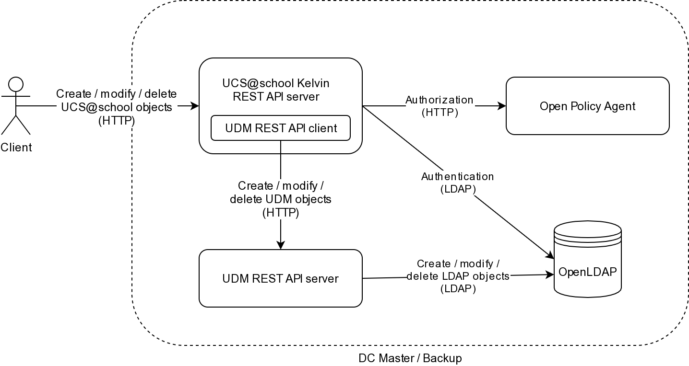

Overview
========

The *UCS\@school Kelvin REST API* provides HTTP endpoints to create and manage UCS\@school domain objects like school users, school classes, schools (OUs) and computer rooms.

The same objects can be managed through a graphical web interface (UMC modules) and a Python API.

The components participating in the *UCS\@school Kelvin REST API* are:

* clients of the *UCS\@school Kelvin REST API* (for example the `Python client`_)
* the *UCS\@school Kelvin REST API* server on the DC master / DC backup [#dcmasterbackup]_
* the `Open Policy Agent`_ used for authorization
* the `UDM REST API *client*`_ component of the *UCS\@school Kelvin REST API*
* the `UDM REST API *server*`_ on the DC master
* the LDAP server on the DC master

Components
----------

To be more precise, let's take a look at the topology picture, starting with the client:

#. Clients are HTTP clients sending requests to ``https://<fqdn>/ucsschool/kelvin/v1/<resource>/`` with ``<fqdn>`` being the address of the DC master and ``<resource>`` being the object type (users, classes etc) to manage.
#. The *UCS\@school Kelvin REST API* can only be accessed through HTTPS on the DC master or DC backup after installing an app (see installation and configuration instructions). The web server `Apache <https://httpd.apache.org/>`_ runs a reverse proxy for the URL path ``/ucsschool/kelvin/``. All access to that path is forwarded to the *UCS\@school Kelvin REST API* server running *inside a Docker container*.
#. To manage the UCS\@school resources, a token must first be retrieved at ``https://<fqdn>/ucsschool/kelvin/token/``. The server will access the OpenLDAP server directly to authenticate and authorize the connecting client. If both succeed, a temporary token is issued to the client.
#. When the client requests a resource (including a valid token in the transmission), the *UCS\@school Kelvin REST API* server will use its *UDM REST API client* component to access the UDM REST API on the DC master.
#. The UDM REST API will then query the OpenLDAP server to retrieve the required information or make the requested changes.

.. _`Python client`: https://kelvin-rest-api-client.readthedocs.io/
.. _`Open Policy Agent`: https://www.openpolicyagent.org/
.. _`UDM REST API *client*`: https://udm-rest-client.readthedocs.io/
.. _`UDM REST API *server*`: https://docs.software-univention.de/developer-reference-5.0.html#udm:rest_api

.. rubric:: Footnotes

.. [#dcmasterbackup] The app *UCS\@school Kelvin REST API* can be installed on both DC master and DC backup. The rest of the text will talk only about *DC master*, but the same is valid for *DC backup*.
