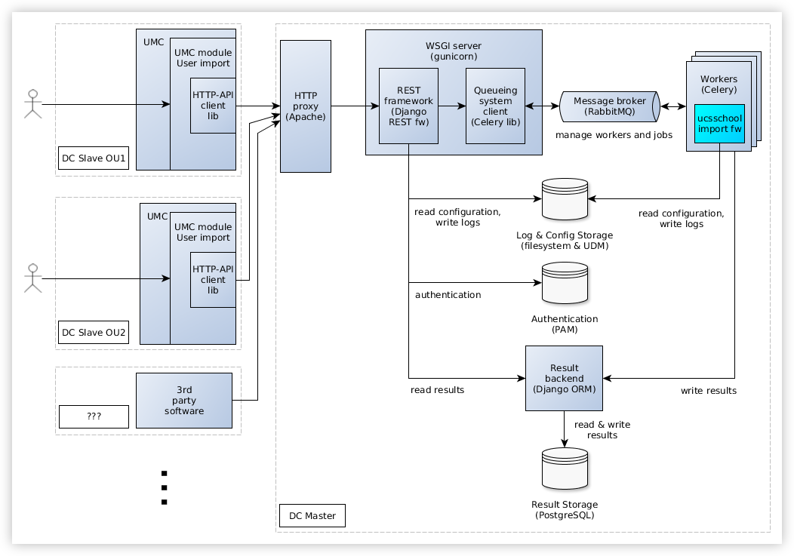

Overview
========

The HTTP-API user import is a system that allows applications to drive the UCS\@school import framework from remote, instead of calling a command line frontend.
A graphical users interface (a UMC module) has been created for users to start imports and read artifacts of previous import jobs.
A Python module was written to ease the use of the HTTP-API.
The UMC module uses that Python-API to access the HTTP-API.

The components participating in the HTTP-API import are on an abstract level:

* clients
* the REST (Web-API) engine
* a task scheduling/queuing system
* storage and database services
* intermediary services

Components
----------

To be more precise, let's take a look at the topology picture and go from client (left) to backend (bottom/right):

#. Clients are HTTP clients. UCS\@school provides a Python-API that makes interaction with the HTTP-API comfortable. This makes the Python code the HTTP client.
#. The HTTP-API can only be accessed through HTTPS on the DC master. The web server `Apache <https://httpd.apache.org/>`_ runs a reverse proxy for the URL path ``/api/`` (UCRV [#UCRV_URL_path_api]_). All access to that path is forwarded to Gunicorn. Apache configuration file: [#apache_conf_file]_.
#. The `Gunicorn <http://gunicorn.org/>`_ Python web application (`WSGI <https://en.wikipedia.org/wiki/Web_Server_Gateway_Interface>`_) server is listening on ``localhost`` on port ``8000`` (UCRV [#UCRV_gunicorn_port]_) for HTTP connections. Gunicorns configuration file: [#gunicorn_conf_file]_.

   #. Gunicorn starts the WSGI application returned by :py:func:`ucsschool.http_api.app.wsgi:application()`.
   #. That is the entry point for the `Django <https://www.djangoproject.com/>`_ web application framework.
   #. Django parses and routes requests to the appropriate view/controller functions.

      #. Djangos routing configuration is in [#django_routes]_ and its main configuration file is [#django_config]_. It is configured to log to [#django_logfile]_.
      #. Django uses `Django PAM <http://django-pam.readthedocs.io/en/latest/>`_ to authenticate against the local PAM stack.
      #. The `Django REST framework <http://www.django-rest-framework.org/>`_ is used to create a HTTP-API with object level authorization, model resource mapping, pagination, request validation etc.
      #. Django uses its own `ORM <https://en.wikipedia.org/wiki/Object-relational_mapping>`_ to read/store objects from/in a `PostgreSQL <https://www.postgresql.org/>`_ database. The DB and required credentials are setup in the join script [#join_script]_. When updating the data models, `DB migration <https://docs.djangoproject.com/en/1.10/topics/migrations/>`_ code can be generated to modify the database to handle the new schema.
      #. When a client creates a new ``user_import`` resource through the HTTP-API, two things happen:

         #. A new Python :py:class:`UserImport` object is created and stored by Django in the database.
         #. A new import job is scheduled for execution.

      #. The Python :py:class:`School` and :py:class:`UserImport` objects are, what the Django REST framework maps to HTTP resources. Not all data of those objects is not stored in the database however. When accessing the log file, password file and summary file attributes, their values will be transparently read from the filesystem.

   #. When creating a new ``user_import`` resource, a new import job should be started. that happens in :py:meth:`UserImportJobSerializer.create()`. That happens, when it executes :py:func:`dry_run()` or :py:func:`import_users()` from :py:mod:`ucsschool.http_api.import_api.tasks`: it creates a new Celery task.

#. The tasks data (specifically the database ID of the :py:class:`UserImport` object) will be sent through the message queuing system `RabbitMQ <https://www.rabbitmq.com/>`_ to one of the two Celery master processes. The routing of a task into a queue is determined by :py:const:`settings.CELERY_ROUTES`.
#. A `Celery <http://www.celeryproject.org/>`_ master process will schedule the tasks execution in one of its worker processes. There are two process groups, because that allows for a different scheduling for dry-runs and real imports: dry-runs can be run 4 in parallel, but of a real import job, there must execute only one at a time. Running ``pstree -a | grep celery`` shows this:

   .. image:: celery_processes.png

#. When it's time for a task to run, it will fetch the :py:class:`UserImport` object using its database ID, and pass a function to the import framework as :py:const:`settings.progress_notification_function`. During the import, the function will be called to update the :py:attr:`result.result` attribute of its associated :py:class:`UserImport` object. The Django ORM will store that in the database. Thus, if a client continually retrieves the ``user_import`` resource, it will see the progress of the import job. The UMC import module uses this to update the progress bar.

CSV data
--------

The format of the CSV file can be configured in the same way it is done for the command line import (see `command line import manual (only german) <http://docs.software-univention.de/ucsschool-import-handbuch-4.3.html>`_).

To create an example CSV file, that works with the default configuration file for HTTP-API-imports ``user_import_http-api.json``, run ``/usr/share/ucs-school-import/scripts/ucs-school-testuser-import`` with the ``--httpapi`` argument.

The contents of the file should look similar to this::

   "Schule","Vorname","Nachname","Klassen","Beschreibung","Telefon","EMail"
   "SchuleEins","Cia","Rothenbühler","1a","A student.","+46-728-963204","ciam.rothenbuehlerm@uni.dtr"
   "SchuleEins","Sergia","Groppel","1b","A student.","+80-043-223750","sergiam.groppelm@uni.dtr"
   [..]

.. important::

    The column with the class names (``Klassen``) must *not* include the school name. The school name will automatically be prepended to it.

.. rubric:: Footnotes

.. [#UCRV_URL_path_api] The URL path ``/api/`` is configurable through UCRV ``ucsschool/import/http_api/URL_path/api``.
.. [#apache_conf_file] Apaches configuration file is ``/etc/apache2/sites-available/ucs-school-import-http-api.conf``.
.. [#UCRV_gunicorn_port] Gunicorns listeneing port is configurable through UCRV
.. [#gunicorn_conf_file] Gunicorns configuration file is ``/etc/gunicorn.d/ucs-school-import``.
.. [#django_config] Djangos configuration file is ``/usr/lib/pymodules/python2.7/ucsschool/http_api/app/settings.py``. But to handle configuration files the Debian way, that file contains just a function to read ``/etc/ucsschool-import/settings.py``, where the real configuration can be found.
.. [#django_logfile] Django ``/var/log/univention/ucs-school-import/http_api.log``.
.. [#django_routes] Requests are routed according to ``/usr/lib/pymodules/python2.7/ucsschool/http_api/app/urls.py``.
.. [#join_script] ``60ucs-school-import-http-api.uinst``
